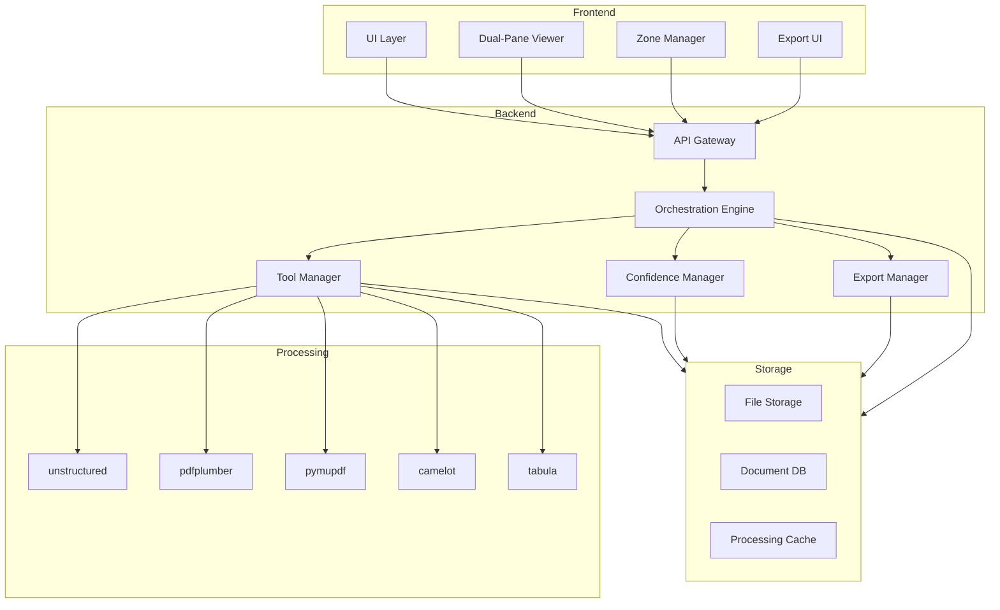

# PDF Processing Platform Architecture

## System Overview



## Component Details

### Frontend Layer
1. **UI Layer**
   - React/TypeScript application
   - shadcn/ui components
   - Tailwind v4 styling
   - State management with Zustand

2. **Dual-Pane Viewer**
   - PDF.js for rendering
   - Canvas overlay for zone selection
   - Real-time confidence visualization
   - Synchronized scrolling

3. **Zone Manager**
   - Zone selection and editing
   - Tool selection interface
   - Confidence display
   - Undo/redo management

4. **Export UI**
   - Export format selection
   - Zone/page selection
   - Progress tracking
   - Error reporting

### Backend Layer
1. **API Gateway**
   - FastAPI (Python)
   - WebSocket support for real-time updates
   - Request validation
   - Error handling

2. **Orchestration Engine**
   - Tool coordination
   - Processing pipeline management
   - Fallback logic
   - Event dispatching

3. **Tool Manager**
   - Tool initialization and cleanup
   - Resource management
   - Error recovery
   - Performance monitoring

4. **Confidence Manager**
   - Confidence calculation
   - Threshold management
   - Merge strategy execution
   - Override handling

5. **Export Manager**
   - Format conversion
   - Schema validation
   - Manifest generation
   - Log compilation

### Processing Layer
1. **Tool Integration**
   ```python
   class ExtractionTool:
       def __init__(self, name: str, priority: int):
           self.name = name
           self.priority = priority
           self.confidence_threshold = self._get_threshold()

       def process(self, zone: Zone) -> ExtractionResult:
           pass

       def validate(self, result: ExtractionResult) -> bool:
           pass

       def _get_threshold(self) -> float:
           thresholds = {
               'text': 0.80,
               'table': 0.70,
               'diagram': 0.60
           }
           return thresholds.get(self.type, 0.80)
   ```

2. **Pipeline Configuration**
   ```yaml
   tools:
     - name: unstructured
       priority: 1
       types: [text, table]
     - name: pdfplumber
       priority: 2
       types: [text]
     - name: pymupdf
       priority: 3
       types: [text]
     - name: camelot
       priority: 1
       types: [table]
     - name: tabula
       priority: 2
       types: [table]
   ```

### Storage Layer
1. **File Storage**
   - PDF documents
   - Extracted content
   - Processing artifacts
   - Export files

2. **Document DB**
   - Zone metadata
   - Processing history
   - User corrections
   - Export manifests

3. **Processing Cache**
   - Intermediate results
   - Tool outputs
   - Confidence scores
   - Temporary files

## Data Flow

### Upload Flow
1. User uploads PDF
2. API validates document
3. Orchestrator initializes processing
4. Tool Manager assigns tools per zone
5. Results stored in cache
6. UI updated with zones

### Processing Flow
1. Tool Manager selects tool
2. Tool processes zone
3. Confidence Manager validates
4. If below threshold, trigger fallback
5. Results merged if multiple tools
6. UI updated with results

### Export Flow
1. User selects export options
2. Export Manager validates zones
3. Formats data per schema
4. Generates manifests and logs
5. Creates export package
6. Delivers to user

## Security Measures

### Input Validation
- PDF format verification
- Size limits
- Content type validation
- Malware scanning

### Processing Security
- Tool isolation
- Resource limits
- Timeout enforcement
- Error containment

### Output Security
- Data sanitization
- Access control
- Audit logging
- Secure storage

## Error Handling

### Tool Failures
1. Log error details
2. Attempt fallback tool
3. If all tools fail:
   - Mark zone as error
   - Insert placeholder
   - Notify user

### System Failures
1. Save processing state
2. Clean up resources
3. Notify administrators
4. Provide user feedback

## Monitoring

### Performance Metrics
- Tool processing times
- Zone confidence scores
- UI response times
- Export generation times

### Health Checks
- Tool availability
- Storage capacity
- Cache status
- API endpoints

### Alerts
- Tool failures
- Low confidence scores
- Export errors
- System resources

## Deployment

### Requirements
- Node.js v18+
- Python 3.9+
- PDF processing tools
- Storage system
- Document DB

### Configuration
- Environment variables
- Tool settings
- Threshold values
- Storage paths

### Scaling
- Horizontal scaling for API
- Tool pool management
- Cache distribution
- Storage replication 