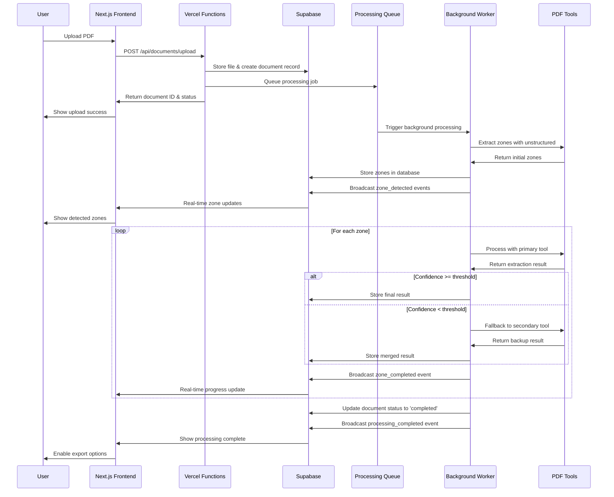
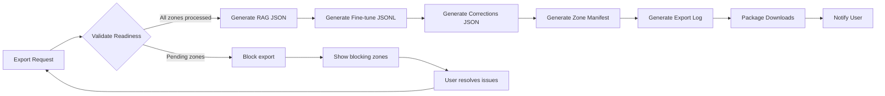

# PDF Intelligence Platform Fullstack Architecture Document

## Introduction

This document outlines the complete fullstack architecture for **PDF Intelligence Platform**, including backend systems, frontend implementation, and their integration. It serves as the single source of truth for AI-driven development, ensuring consistency across the entire technology stack.

This unified approach combines what would traditionally be separate backend and frontend architecture documents, streamlining the development process for modern fullstack applications where these concerns are increasingly intertwined.

### Architectural Success Criteria

This architecture is designed to achieve:

**Technical Excellence:**
- Sub-30 second processing for documents up to 50 pages
- Real-time UI responsiveness (< 100ms updates)
- Graceful degradation when individual tools fail
- Memory-efficient handling of large documents

**User Experience Goals:**
- Intuitive zone management and editing
- Seamless dual-pane synchronization
- Clear confidence visualization
- Actionable error messages

**Developer Experience Targets:**
- AI-agent friendly with clear separation of concerns
- Type-safe interfaces with shared TypeScript types
- Testable architecture with isolated components
- Documentation clarity for easy extension

**System Reliability Standards:**
- Fault tolerance across all processing tools
- Data consistency between user overrides and processing state
- Export integrity with schema validation
- Comprehensive error handling and recovery

### Starter Template or Existing Project

**Status:** Greenfield project

The PDF Intelligence Platform is being built from scratch with:
- Existing Next.js foundation with shadcn/ui components
- Playwright MCP integration for testing
- Comprehensive technical specifications from analysis phase
- No existing PDF processing infrastructure to constrain design

### Change Log

| Date | Version | Description | Author |
|------|---------|-------------|---------|
| 2025-07-26 | 1.0 | Initial fullstack architecture document creation | Winston (Architect) |
| 2025-07-26 | 2.0 | Complete architecture with platform analysis, tech stack, components, data flow, and deployment | Winston (Architect) |

## High Level Architecture

### Technical Summary

The PDF Intelligence Platform employs a **modern fullstack serverless architecture** with real-time capabilities, deployed on **Vercel + Supabase** for rapid development and automatic scaling. The **Next.js frontend** handles dual-pane PDF rendering and zone management, while **hybrid serverless functions** orchestrate multiple PDF processing tools (unstructured, pdfplumber, pymupdf, camelot, tabula) with confidence-based merging. **WebSocket integration** provides real-time processing updates, and the **component-based architecture** ensures AI agents can develop and maintain each part independently. This architecture achieves PRD goals through intelligent tool orchestration, transparent user feedback, and structured export generation.

### Platform and Infrastructure Choice

Based on analysis of processing timeout risks, real-time requirements, and AI-agent development needs:

**Recommended Platform: Vercel + Supabase with Hybrid Processing**

**Key Services:**
- **Vercel Functions**: Fast operations (UI, auth, simple queries)
- **Supabase Edge Functions**: Long-running PDF processing operations
- **Supabase Database**: State management and metadata storage
- **Supabase Storage**: PDF files and export results
- **Supabase Realtime**: WebSocket connections for live updates
- **Supabase Auth**: User authentication and authorization

**Deployment Strategy:**
- **Frontend**: Vercel Edge Network (global CDN)
- **Processing**: Hybrid edge + background workers
- **Database**: Supabase US-East-1 (primary region)

**Architecture Benefits:**
- **Timeout Mitigation**: Queue-based processing for long operations
- **Developer Velocity**: Integrated toolchain optimized for AI-agent development
- **Real-time Capability**: Built-in WebSocket support with state persistence
- **Cost Optimization**: Pay-per-use scaling with predictable costs

### Repository Structure

**Structure:** Monorepo with npm workspaces
**Organization:** Feature-based packages with shared utilities

```
pdf-intelligence-platform/
├── apps/
│   ├── web/                    # Next.js frontend application
│   └── processing/             # Serverless processing functions
├── packages/
│   ├── shared/                 # Shared TypeScript types and utilities
│   ├── ui/                     # Shared UI components (shadcn/ui)
│   └── config/                 # Shared configuration (ESLint, TypeScript)
├── docs/                       # Architecture and documentation
└── infrastructure/             # Deployment configurations
```

**Benefits:**
- **Type Safety**: Shared interfaces between frontend and backend
- **Code Reuse**: Common utilities and components
- **AI-Agent Friendly**: Clear package boundaries for autonomous development
- **Simplified Dependencies**: Single dependency management

### Architectural Patterns

The following patterns guide both frontend and backend development:

- **Serverless Event-Driven Architecture**: Decoupled functions triggered by events - _Rationale:_ Enables automatic scaling and cost optimization for variable PDF processing workloads
- **Component-Based UI with TypeScript**: Reusable React components with strict typing - _Rationale:_ Maintainability and type safety across large codebases, optimal for AI-agent development
- **Queue-Worker Pattern**: Asynchronous job processing with reliable queues - _Rationale:_ Handles long-running PDF processing without timeout failures
- **Repository Pattern with Supabase**: Abstract data access through service layers - _Rationale:_ Enables testing and maintains clean separation between business logic and data persistence
- **Real-time State Synchronization**: WebSocket-based live updates with database backing - _Rationale:_ Critical for user experience during long processing operations
- **Confidence-Based Decision Pattern**: Weighted scoring system for tool output merging - _Rationale:_ Ensures optimal extraction quality while maintaining transparency
- **Optimistic UI Updates**: Client-side state updates with server reconciliation - _Rationale:_ Responsive user experience with eventual consistency

### High Level Architecture Diagram

```mermaid
graph TD
    subgraph "User Interface"
        UI[Next.js Frontend]
        DP[Dual-Pane PDF Viewer]
        ZM[Zone Manager]
    end
    
    subgraph "Vercel Edge"
        VF[Vercel Functions]
        API[API Routes]
        WS[WebSocket Handlers]
    end
    
    subgraph "Supabase Backend"
        DB[(PostgreSQL Database)]
        ST[Storage Buckets]
        RT[Realtime Engine]
        EF[Edge Functions]
    end
    
    subgraph "Processing Queue"
        JQ[Job Queue]
        BG[Background Workers]
    end
    
    subgraph "PDF Processing Tools"
        T1[unstructured]
        T2[pdfplumber] 
        T3[pymupdf]
        T4[camelot]
        T5[tabula]
    end
    
    subgraph "External Services"
        CDN[Vercel CDN]
        MON[Monitoring]
    end

    UI --> VF
    DP --> WS
    ZM --> API
    
    VF --> DB
    WS --> RT
    API --> EF
    
    EF --> JQ
    JQ --> BG
    BG --> T1
    BG --> T2
    BG --> T3
    BG --> T4
    BG --> T5
    
    BG --> DB
    BG --> ST
    
    RT --> UI
    CDN --> UI
    MON --> VF
         MON --> EF
 ```

## Tech Stack

### Technology Selection

This section defines the **DEFINITIVE** technology stack for the PDF Intelligence Platform. All development must use these exact versions and tools.

| Category | Technology | Version | Rationale |
|----------|------------|---------|-----------|
| **Frontend Framework** | Next.js | 14.x | Built-in PDF handling, Vercel optimization, App Router, TypeScript integration |
| **UI Framework** | React | 18.x | Component ecosystem, TypeScript support, Next.js requirement |
| **Language** | TypeScript | 5.x | Type safety, AI-agent compatibility, shared interfaces |
| **Styling** | Tailwind CSS | 4.x | Utility-first, design system consistency, rapid development |
| **UI Components** | shadcn/ui | Latest | Pre-built accessible components, TypeScript, Tailwind integration |
| **PDF Rendering** | PDF.js | 4.x | Browser-native, Canvas API integration, zone selection support |
| **State Management** | React Query + Zustand | 5.x + 4.x | Server state + client state separation, real-time sync |
| **Real-time** | Supabase Realtime | Latest | WebSocket abstraction, database integration |
| **Backend Platform** | Supabase | Latest | Integrated backend services, PostgreSQL, real-time, auth |
| **Serverless Functions** | Vercel Functions + Supabase Edge | Latest | Hybrid processing, timeout mitigation |
| **Database** | PostgreSQL (Supabase) | 15.x | JSON support, full-text search, reliability |
| **File Storage** | Supabase Storage | Latest | Integrated with database, access controls |
| **Queue System** | Supabase Edge Functions + pg_cron | Latest | Background job processing, reliable delivery |
| **PDF Processing** | Python ecosystem | 3.11+ | Mature tools: unstructured, pdfplumber, pymupdf, camelot, tabula |
| **API Framework** | Next.js API Routes | 14.x | Type-safe endpoints, serverless deployment |
| **Testing Framework** | Playwright | Latest | E2E testing, MCP integration, visual testing |
| **Package Manager** | npm | 9.x+ | Workspace support, dependency management |
| **Development** | Cursor IDE + Claude | Latest | AI-agent development, BMAD integration |
| **Deployment** | Vercel | Latest | Automatic deployments, edge network, monitoring |
| **Monitoring** | Vercel Analytics + Supabase Metrics | Latest | Performance monitoring, error tracking |

### Technology Integration Strategy

**Frontend-Backend Communication:**
- **API Routes**: Next.js API routes for CRUD operations
- **WebSockets**: Supabase Realtime for live updates
- **File Upload**: Direct to Supabase Storage with signed URLs
- **Authentication**: Supabase Auth with Next.js middleware

**Processing Architecture:**
- **Fast Operations**: Vercel Edge Functions (< 1s operations)
- **Long Processing**: Supabase Edge Functions with queue system
- **Tool Orchestration**: Python workers managed by Edge Functions
- **State Persistence**: PostgreSQL with real-time sync

**Development Workflow:**
- **Monorepo**: npm workspaces for shared packages
- **Type Safety**: Shared TypeScript interfaces across packages
- **Testing**: Playwright MCP for comprehensive e2e coverage
- **AI Development**: Cursor IDE with BMAD agent integration

### Key Dependencies

**Critical Path Dependencies:**
```json
{
  "next": "^14.0.0",
  "react": "^18.0.0", 
  "typescript": "^5.0.0",
  "@supabase/supabase-js": "^2.38.0",
  "pdf-js-dist": "^4.0.0",
  "@tanstack/react-query": "^5.0.0",
  "zustand": "^4.4.0",
  "tailwindcss": "^4.0.0"
}
```

**Processing Tools (Python):**
```python
unstructured==0.11.0
pdfplumber==0.9.0
pymupdf==1.23.0
camelot-py==0.11.0
tabula-py==2.7.0
```

## Component Design

### Frontend Components

#### Core UI Components

**PDF Viewer Component (`app/components/viewer/PDFViewer.tsx`)**
```typescript
interface PDFViewerProps {
  pdfUrl: string;
  zones: Zone[];
  selectedZone?: string;
  onZoneSelect: (zoneId: string) => void;
  onZoneCreate: (zone: CreateZoneRequest) => void;
  confidenceThreshold: number;
}

interface Zone {
  id: string;
  page: number;
  coordinates: { x: number; y: number; width: number; height: number };
  content: string;
  confidence: number;
  type: 'text' | 'table' | 'diagram';
  status: 'processing' | 'completed' | 'error' | 'manual_override';
  tool: string;
  lastUpdated: Date;
}
```

**Dual-Pane Manager (`app/components/layout/DualPaneManager.tsx`)**
```typescript
interface DualPaneManagerProps {
  leftPanel: React.ComponentType;
  rightPanel: React.ComponentType;
  syncScrolling: boolean;
  splitRatio: number;
  onSplitChange: (ratio: number) => void;
}

interface SyncState {
  leftScroll: number;
  rightScroll: number;
  zoom: number;
  page: number;
}
```

**Zone Editor Component (`app/components/zones/ZoneEditor.tsx`)**
```typescript
interface ZoneEditorProps {
  zone: Zone;
  onContentUpdate: (zoneId: string, content: string) => void;
  onReprocess: (zoneId: string, tool?: string) => void;
  onRevert: (zoneId: string) => void;
  availableTools: ProcessingTool[];
  isEditing: boolean;
}

interface ProcessingTool {
  name: string;
  supportedTypes: string[];
  priority: number;
  estimatedTime: number;
}
```

#### State Management Hooks

**Document State Hook (`app/hooks/useDocument.ts`)**
```typescript
interface DocumentState {
  document: Document | null;
  zones: Zone[];
  processing: ProcessingStatus;
  error: string | null;
}

interface ProcessingStatus {
  totalZones: number;
  completedZones: number;
  currentlyProcessing: string[];
  estimatedTimeRemaining: number;
}

export const useDocument = (documentId: string) => {
  // React Query + Zustand integration
  // Real-time updates via Supabase
  // Optimistic updates for UI responsiveness
}
```

**WebSocket Hook (`app/hooks/useWebSocket.ts`)**
```typescript
interface WebSocketState {
  connected: boolean;
  reconnecting: boolean;
  lastMessage: WebSocketMessage | null;
}

interface WebSocketMessage {
  type: 'zone_updated' | 'processing_progress' | 'export_ready';
  payload: any;
  timestamp: Date;
}

export const useWebSocket = (documentId: string) => {
  // Supabase Realtime integration
  // Automatic reconnection logic
  // Message queuing during disconnection
}
```

### Backend Services

#### PDF Processing Service (`lib/pdf-processing/orchestrator.ts`)**
```typescript
interface ProcessingOrchestrator {
  processDocument(documentId: string): Promise<ProcessingResult>;
  processZone(zoneId: string, tool?: string): Promise<ZoneResult>;
  getProcessingStatus(documentId: string): Promise<ProcessingStatus>;
  cancelProcessing(documentId: string): Promise<void>;
}

interface ProcessingResult {
  documentId: string;
  zones: Zone[];
  overallConfidence: number;
  processingTime: number;
  errors: ProcessingError[];
}

interface ZoneResult {
  zoneId: string;
  content: string;
  confidence: number;
  tool: string;
  metadata: ProcessingMetadata;
}
```

#### Confidence Manager (`lib/pdf-processing/confidence.ts`)**
```typescript
interface ConfidenceManager {
  calculateZoneConfidence(results: ToolResult[]): number;
  mergeToolResults(results: ToolResult[]): MergedResult;
  shouldFallback(result: ToolResult, threshold: number): boolean;
  getToolPriority(contentType: string): ProcessingTool[];
}

interface ToolResult {
  tool: string;
  content: string;
  confidence: number;
  metadata: any;
  processingTime: number;
}

interface MergedResult {
  content: string;
  confidence: number;
  contributingTools: string[];
  fallbackHistory: string[];
}
```

#### Export Service (`lib/export/manager.ts`)**
```typescript
interface ExportManager {
  validateExportReadiness(documentId: string): Promise<ExportValidation>;
  generateExports(documentId: string, formats: ExportFormat[]): Promise<ExportResult>;
  getExportStatus(exportId: string): Promise<ExportStatus>;
}

interface ExportValidation {
  ready: boolean;
  blockers: ExportBlocker[];
  warnings: ExportWarning[];
  estimatedSize: number;
}

interface ExportResult {
  exportId: string;
  files: ExportFile[];
  manifest: ExportManifest;
  downloadUrls: Record<string, string>;
}
```

### API Endpoints

#### Document Management APIs
```typescript
// POST /api/documents/upload
interface UploadRequest {
  file: File;
  options: ProcessingOptions;
}

// GET /api/documents/[id]
interface DocumentResponse {
  document: Document;
  zones: Zone[];
  processingStatus: ProcessingStatus;
}

// PUT /api/zones/[id]
interface ZoneUpdateRequest {
  content?: string;
  reprocess?: boolean;
  tool?: string;
}

// POST /api/export/[documentId]
interface ExportRequest {
  formats: ExportFormat[];
  includeZones?: string[];
  options: ExportOptions;
}
```

#### Real-time Event Schema
```typescript
interface RealtimeEvent {
  type: 'zone_processing_started' | 'zone_processing_completed' | 'zone_processing_failed' | 'export_ready';
  documentId: string;
  zoneId?: string;
  payload: any;
  timestamp: Date;
}
```

### Database Schema

#### Core Tables
```sql
-- Documents table
CREATE TABLE documents (
  id UUID PRIMARY KEY DEFAULT gen_random_uuid(),
  name TEXT NOT NULL,
  file_path TEXT NOT NULL,
  file_size INTEGER NOT NULL,
  page_count INTEGER NOT NULL,
  status TEXT NOT NULL DEFAULT 'uploaded',
  created_at TIMESTAMP WITH TIME ZONE DEFAULT NOW(),
  updated_at TIMESTAMP WITH TIME ZONE DEFAULT NOW()
);

-- Zones table
CREATE TABLE zones (
  id UUID PRIMARY KEY DEFAULT gen_random_uuid(),
  document_id UUID NOT NULL REFERENCES documents(id) ON DELETE CASCADE,
  page INTEGER NOT NULL,
  coordinates JSONB NOT NULL,
  content TEXT,
  content_type TEXT NOT NULL,
  confidence FLOAT,
  tool TEXT,
  status TEXT NOT NULL DEFAULT 'pending',
  processing_history JSONB DEFAULT '[]',
  created_at TIMESTAMP WITH TIME ZONE DEFAULT NOW(),
  updated_at TIMESTAMP WITH TIME ZONE DEFAULT NOW()
);

-- Processing jobs table
CREATE TABLE processing_jobs (
  id UUID PRIMARY KEY DEFAULT gen_random_uuid(),
  document_id UUID NOT NULL REFERENCES documents(id) ON DELETE CASCADE,
  zone_id UUID REFERENCES zones(id) ON DELETE CASCADE,
  tool TEXT NOT NULL,
  status TEXT NOT NULL DEFAULT 'queued',
  result JSONB,
  error_message TEXT,
  started_at TIMESTAMP WITH TIME ZONE,
  completed_at TIMESTAMP WITH TIME ZONE,
  created_at TIMESTAMP WITH TIME ZONE DEFAULT NOW()
);

-- Exports table
CREATE TABLE exports (
  id UUID PRIMARY KEY DEFAULT gen_random_uuid(),
  document_id UUID NOT NULL REFERENCES documents(id) ON DELETE CASCADE,
  format TEXT NOT NULL,
  file_path TEXT,
  status TEXT NOT NULL DEFAULT 'pending',
  metadata JSONB,
  created_at TIMESTAMP WITH TIME ZONE DEFAULT NOW(),
  completed_at TIMESTAMP WITH TIME ZONE
);
```

## Data Flow and Processing

### Document Upload and Processing Flow



### Real-time State Synchronization

**State Management Strategy:**
- **Optimistic Updates**: UI updates immediately for user actions
- **Server Reconciliation**: Background sync with database state
- **Conflict Resolution**: Last-write-wins with manual override priority
- **Event Sourcing**: All changes tracked for audit and recovery

**WebSocket Event Types:**
```typescript
type RealtimeEvents = 
  | 'zone_detected'           // New zone identified
  | 'zone_processing_started' // Tool processing began
  | 'zone_processing_progress'// Intermediate progress update
  | 'zone_processing_completed' // Tool processing finished
  | 'zone_manual_override'    // User manual edit
  | 'document_export_ready'   // Export files generated
  | 'system_error'           // Processing error occurred
```

### Export Generation Flow



## Deployment and Infrastructure

### Environment Configuration

**Development Environment:**
```bash
# Local development setup
npm install                    # Install dependencies
npm run dev                   # Start Next.js dev server
supabase start               # Start local Supabase
npx playwright test          # Run e2e tests
```

**Staging Environment:**
- **Platform**: Vercel Preview Deployments
- **Database**: Supabase staging project
- **Domain**: `pdf-platform-staging.vercel.app`
- **Features**: Production mirroring, test data, CI/CD integration

**Production Environment:**
- **Platform**: Vercel Production
- **Database**: Supabase production project  
- **Domain**: `app.pdf-intelligence.com`
- **Features**: Full monitoring, analytics, error tracking

### Infrastructure as Code

**Supabase Configuration (`supabase/config.toml`):**
```toml
[api]
enabled = true
port = 54321
schemas = ["public"]
extra_search_path = ["public"]

[db]
port = 54322
shadow_port = 54320
major_version = 15

[storage]
enabled = true
file_size_limit = "50MB"
image_transformation = { enabled = true }

[auth]
enabled = true
site_url = "http://localhost:3000"

[edge_functions]
enabled = true
```

**Vercel Configuration (`vercel.json`):**
```json
{
  "framework": "nextjs",
  "buildCommand": "npm run build",
  "functions": {
    "app/api/**/*.ts": {
      "maxDuration": 60
    }
  },
  "env": {
    "NEXT_PUBLIC_SUPABASE_URL": "@supabase-url",
    "NEXT_PUBLIC_SUPABASE_ANON_KEY": "@supabase-anon-key",
    "SUPABASE_SERVICE_ROLE_KEY": "@supabase-service-key"
  }
}
```

### Monitoring and Observability

**Performance Monitoring:**
- **Frontend**: Vercel Analytics, Web Vitals tracking
- **Backend**: Supabase metrics, function execution times
- **Processing**: Custom metrics for tool performance and confidence scores
- **Database**: Query performance, connection pooling metrics

**Error Tracking:**
- **Application Errors**: Integrated error boundary with Vercel
- **Processing Failures**: Detailed error logs with tool-specific context
- **WebSocket Issues**: Connection failure tracking and recovery metrics
- **Export Failures**: Schema validation errors and file generation issues

**Business Metrics:**
- **Processing Success Rate**: % of documents successfully processed
- **Average Processing Time**: Per document and per zone
- **Tool Performance**: Success rates and confidence scores by tool
- **User Engagement**: Zone editing frequency, export usage patterns

### Security Implementation

**Authentication and Authorization:**
```typescript
// Supabase Auth integration
export const auth = {
  signIn: (email: string, password: string) => supabase.auth.signInWithPassword({email, password}),
  signUp: (email: string, password: string) => supabase.auth.signUp({email, password}),
  signOut: () => supabase.auth.signOut(),
  getUser: () => supabase.auth.getUser()
}

// Row Level Security policies
CREATE POLICY "Users can only access their own documents" ON documents
  FOR ALL USING (auth.uid() = user_id);

CREATE POLICY "Users can only modify their own zones" ON zones
  FOR ALL USING (EXISTS (
    SELECT 1 FROM documents WHERE documents.id = zones.document_id 
    AND documents.user_id = auth.uid()
  ));
```

**Data Protection:**
- **File Encryption**: Supabase Storage encryption at rest
- **API Security**: Rate limiting, request validation, CORS configuration
- **Database Security**: Row-level security, encrypted connections
- **Processing Security**: Sandboxed tool execution, resource limits

---

## Architecture Summary

This fullstack architecture provides:

✅ **Scalable Processing**: Hybrid serverless architecture handles variable workloads  
✅ **Real-time Experience**: WebSocket integration with optimistic UI updates  
✅ **Type Safety**: End-to-end TypeScript with shared interfaces  
✅ **AI-Agent Ready**: Clear component boundaries and comprehensive documentation  
✅ **Production Ready**: Monitoring, security, and deployment automation  
✅ **Developer Experience**: Integrated toolchain with rapid iteration cycles  

**Next Steps for Development:**
1. **Initialize** monorepo structure with shared packages
2. **Set up** Supabase project and database schema  
3. **Implement** core components starting with PDF viewer
4. **Build** processing pipeline with confidence management
5. **Deploy** staging environment for testing and validation

This architecture serves as the definitive blueprint for the PDF Intelligence Platform development. 