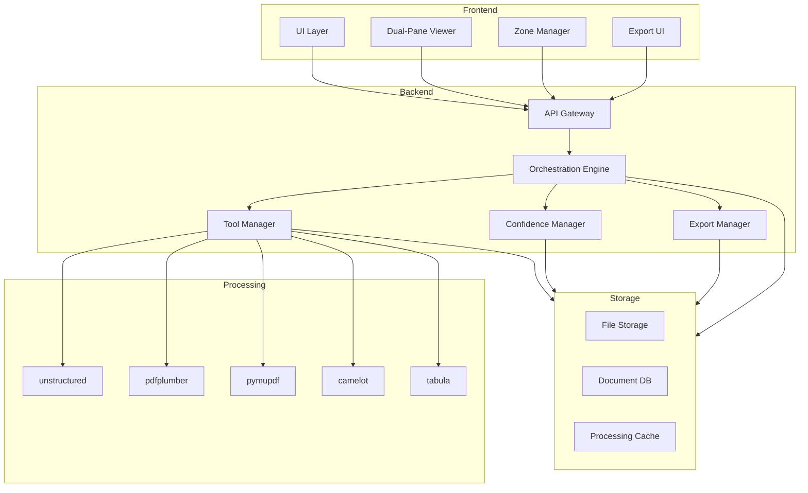

# System Architecture Overview

## System Components

## Component Responsibilities

### Frontend Components
- **UI Layer**: Main application interface
- **Dual-Pane Viewer**: PDF and extracted content display
- **Zone Manager**: Selection and editing interface
- **Export UI**: Export management interface

### Backend Components
- **API Gateway**: Request handling and routing
- **Orchestration Engine**: Process coordination
- **Tool Manager**: PDF processing tool management
- **Confidence Manager**: Confidence scoring and merging
- **Export Manager**: Export format handling

### Processing Components
- **Extraction Tools**: PDF content extraction
- **Tool Priority**: Processing sequence
- **Fallback Logic**: Error handling
- **Result Merging**: Content combination

### Storage Components
- **File Storage**: Document storage
- **Document DB**: Metadata storage
- **Processing Cache**: Temporary data

## Key Interactions

### Upload Flow
1. UI → API Gateway
2. API Gateway → Orchestration Engine
3. Orchestration → Tool Manager
4. Tool Manager → Processing Tools
5. Results → Storage

### Processing Flow
1. Tool Manager → Tool Selection
2. Tool → Content Processing
3. Results → Confidence Manager
4. Storage → Results Cache
5. UI → Results Display

### Export Flow
1. Export UI → API Gateway
2. API Gateway → Export Manager
3. Export Manager → Format Processing
4. Storage → Export Files
5. UI → Download 