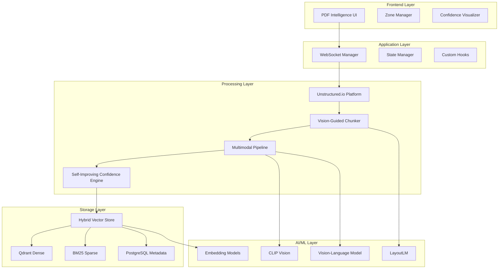

# Unstructured Data Processing Integration Plan for PDF Intelligence Platform
**Strategic Implementation Roadmap Based on 2025 Best Practices Research**

## 📊 Current State Analysis

### ✅ **What's Been Accomplished (Stories 1-3)**
- **Story 1**: PDF upload with drag-drop, validation, progress tracking
- **Story 2**: WebSocket real-time communication system  
- **Story 3**: Basic PDF processing foundation
- **Infrastructure**: Next.js + TypeScript, shadcn/ui, WebSocket server

### 🎯 **What's Planned (Epic 1: Stories 4-7)**
- **Story 4**: Complete PDF upload and initial processing integration
- **Story 5**: Advanced zone detection and tool assignment
- **Story 6**: Content extraction pipeline
- **Story 7**: Confidence scoring and merging

### 🔍 **Current PDF Processing Tools**
Based on existing codebase analysis:
```typescript
// Current tool integrations (partial implementations)
{
  unstructured: { accuracy: 0.95, speed: 'fast', specializations: ['general_text', 'mixed_content'] },
  pdfplumber: { accuracy: 0.88, speed: 'medium', specializations: ['structured_text', 'coordinate_extraction'] },
  camelot: { accuracy: 0.95, speed: 'slow', specializations: ['complex_tables', 'bordered_tables'] },
  tabula: { accuracy: 0.88, speed: 'fast', specializations: ['stream_detection', 'simple_tables'] },
  pymupdf: { accuracy: 0.80, speed: 'fast', specializations: ['text_extraction'] },
  visual_analyzer: { accuracy: 0.75, speed: 'slow', specializations: ['image_processing', 'chart_recognition'] }
}
```

---

## 🎯 Strategic Integration Opportunities

### **Gap Analysis: Current vs. 2025 Best Practices**

| Component | Current State | 2025 Best Practice | Integration Priority |
|-----------|---------------|-------------------|---------------------|
| **Document Processing** | Basic tool orchestration | Enhanced local Unstructured + Vision-guided chunking | 🔴 **HIGH** |
| **Chunking Strategy** | Simple by-title chunking | Semantic + Vision-guided + Multimodal chunking | 🔴 **HIGH** |
| **Content Recognition** | Rule-based classification | AI-powered multimodal understanding (LayoutLM, CLIP) | 🟡 **MEDIUM** |
| **Storage Architecture** | Basic file storage | Hybrid vector store (dense + sparse + metadata) | 🟡 **MEDIUM** |
| **Quality Assessment** | Basic confidence scoring | Comprehensive quality metrics + continuous improvement | 🟢 **LOW** |
| **Error Recovery** | Simple fallback logic | Advanced resilience patterns + federated learning | 🟢 **LOW** |

---

## 🚀 Implementation Roadmap

### **Phase 1: Foundation Enhancement (Weeks 1-2)**
*Upgrade current tools to 2025 standards*

#### **1.1: Enhanced Local Unstructured Integration**
```typescript
// Upgrade current local unstructured integration
// From: Basic Python subprocess calls
// To: Optimized local processing with advanced features

class EnhancedLocalUnstructuredProcessor {
  constructor() {
    this.pythonPath = process.env.PYTHON_PATH || 'python';
    this.unstructuredPath = path.join(__dirname, '../python/unstructured_processor.py');
    this.tempDir = path.join(__dirname, '../../temp');
  }

  async processDocument(document: Document): Promise<ProcessedDocument> {
    const tempFilePath = await this.saveToTemp(document.file);
    
    const processingArgs = {
      strategy: 'hi_res',
      chunking_strategy: 'by_title',
      max_characters: 1000,
      new_after_n_chars: 800,
      overlap: 200,
      coordinates: true,
      include_page_breaks: true,
      languages: ['en'],
      extract_image_block_types: ['image', 'table'],
      output_dir: this.tempDir,
      filename: tempFilePath
    };

    // Execute enhanced Python processor
    const result = await this.executePythonProcessor(processingArgs);
    return this.enhanceWithMetadata(result.elements);
  }

  private async executePythonProcessor(args: any): Promise<any> {
    return new Promise((resolve, reject) => {
      const pythonProcess = spawn(this.pythonPath, [
        this.unstructuredPath,
        JSON.stringify(args)
      ]);
      
      let output = '';
      pythonProcess.stdout.on('data', (data) => output += data);
      pythonProcess.on('close', (code) => {
        if (code === 0) {
          resolve(JSON.parse(output));
        } else {
          reject(new Error(`Python process failed with code ${code}`));
        }
      });
    });
  }
}
```

#### **1.2: Vision-Guided Chunking Implementation**
```typescript
// Enhance existing chunking with multimodal understanding
class VisionGuidedChunker extends ContentAnalyzer {
  private vlm: MultimodalModel;

  constructor() {
    super();
    this.vlm = new MultimodalModel('gemini-2.5-pro'); // Or gpt-4-vision
  }

  async chunkDocument(document: PDFDocument): Promise<SemanticChunk[]> {
    // Stage 1: Visual layout analysis
    const layoutAnalysis = await this.analyzeLayout(document.pages);
    
    // Stage 2: Content classification
    const contentRegions = await this.classifyContent(layoutAnalysis);
    
    // Stage 3: Semantic boundary detection
    const semanticBoundaries = await this.detectSemanticBoundaries(
      contentRegions, 
      document.text
    );
    
    // Stage 4: Generate contextually aware chunks
    return this.generateChunks(semanticBoundaries, layoutAnalysis);
  }
}
```

### **Phase 2: Multimodal Enhancement (Weeks 3-4)**
*Add advanced content understanding capabilities*

#### **2.1: LayoutLM Integration for Document Understanding**
```typescript
// Enhance Story 5: Zone Detection with LayoutLM
class AdvancedZoneDetector {
  private layoutModel: LayoutLMProcessor;
  private visionModel: CLIPProcessor;

  constructor() {
    this.layoutModel = new LayoutLMProcessor('microsoft/layoutlmv3-base');
    this.visionModel = new CLIPProcessor('openai/clip-vit-large-patch14');
  }

  async detectZones(document: PDFDocument): Promise<DocumentZone[]> {
    const zones = [];
    
    for (const page of document.pages) {
      // Extract layout features
      const layoutFeatures = await this.layoutModel.extractFeatures(page);
      
      // Visual analysis for complex content
      const visualFeatures = await this.visionModel.analyzeImage(page.image);
      
      // Combine features for zone classification
      const detectedZones = await this.classifyZones(
        layoutFeatures, 
        visualFeatures, 
        page.text
      );
      
      zones.push(...detectedZones);
    }
    
    return this.optimizeZones(zones);
  }
}
```

#### **2.2: Multimodal Content Processing Pipeline**
```typescript
// Enhance Story 6: Processing Pipeline with multimodal capabilities
class MultimodalProcessingPipeline extends ProcessingOrchestrator {
  async processZone(zone: DocumentZone): Promise<ProcessingResult> {
    switch (zone.contentType) {
      case 'text':
        return this.processTextZone(zone);
      case 'table':
        return this.processTableZone(zone);
      case 'image':
        return this.processImageZone(zone);
      case 'diagram':
        return this.processDiagramZone(zone);
      case 'mixed':
        return this.processMultimodalZone(zone);
      default:
        return this.processUnknownZone(zone);
    }
  }

  private async processMultimodalZone(zone: DocumentZone): Promise<ProcessingResult> {
    // Use vision-language model for complex content
    const vlmResult = await this.vlm.processMultimodalContent({
      text: zone.text,
      image: zone.image,
      layout: zone.layout,
      context: zone.context
    });

    // Combine with specialized tools
    const specializedResults = await Promise.all([
      this.processWithUnstructured(zone),
      this.processWithPDFPlumber(zone),
      this.processWithVisualAnalyzer(zone)
    ]);

    // Merge results with confidence weighting
    return this.mergeMultimodalResults(vlmResult, specializedResults);
  }
}
```

### **Phase 3: Advanced Intelligence (Weeks 5-6)**
*Implement 2025 AI-native features*

#### **3.1: Hybrid Vector Storage Implementation**
```typescript
// Replace basic storage with hybrid approach
class HybridVectorStore {
  private denseStore: QdrantClient;
  private sparseStore: BM25Retriever;
  private metadataStore: PostgresClient;

  constructor() {
    this.denseStore = new QdrantClient({ host: 'localhost', port: 6333 });
    this.sparseStore = new BM25Retriever();
    this.metadataStore = new PostgresClient();
  }

  async storeChunks(chunks: SemanticChunk[]): Promise<void> {
    for (const chunk of chunks) {
      // Generate dense embeddings
      const denseEmbedding = await this.generateDenseEmbedding(chunk.text);
      
      // Generate sparse representation
      const sparseVector = this.sparseStore.vectorize(chunk.text);
      
      // Store in hybrid fashion
      await Promise.all([
        this.denseStore.upsert('dense_chunks', {
          id: chunk.id,
          vector: denseEmbedding,
          payload: { text: chunk.text, metadata: chunk.metadata }
        }),
        this.sparseStore.index(chunk.id, chunk.text),
        this.metadataStore.insert('chunk_metadata', {
          id: chunk.id,
          zone_id: chunk.zoneId,
          confidence_score: chunk.confidence,
          processing_metadata: chunk.processingMetadata
        })
      ]);
    }
  }

  async hybridSearch(query: string, topK: number = 10): Promise<SearchResult[]> {
    // Dense retrieval
    const denseResults = await this.denseStore.search('dense_chunks', {
      vector: await this.generateDenseEmbedding(query),
      limit: topK * 2
    });

    // Sparse retrieval
    const sparseResults = await this.sparseStore.search(query, topK * 2);

    // Reciprocal Rank Fusion
    return this.rankFusion(denseResults, sparseResults, topK);
  }
}
```

#### **3.2: Self-Improving Confidence Engine**
```typescript
// Enhance Story 7: Confidence Scoring with 2025 AI patterns
class SelfImprovingConfidenceEngine extends AdvancedConfidenceEngine {
  private feedbackCollector: FeedbackCollector;
  private modelUpdater: ModelUpdater;

  async assessConfidence(result: ProcessingResult): Promise<ConfidenceScore> {
    // Multi-dimensional confidence assessment
    const dimensions = {
      extraction_completeness: await this.assessCompleteness(result),
      semantic_coherence: await this.assessCoherence(result),
      structural_preservation: await this.assessStructure(result),
      factual_accuracy: await this.assessAccuracy(result),
      multimodal_consistency: await this.assessMultimodalConsistency(result)
    };

    // AI-calibrated confidence scoring
    const overallConfidence = await this.calibrateConfidence(dimensions);

    // Continuous learning from feedback
    await this.incorporateFeedback(result, overallConfidence);

    return {
      overall: overallConfidence,
      dimensions,
      calibration_metadata: this.getCalibrationMetadata(),
      improvement_suggestions: await this.generateImprovements(result, dimensions)
    };
  }

  private async incorporateFeedback(
    result: ProcessingResult, 
    confidence: number
  ): Promise<void> {
    // Collect implicit feedback (user corrections, re-processing requests)
    const feedback = await this.feedbackCollector.collectImplicitFeedback(result);
    
    // Update model if sufficient feedback accumulated
    if (await this.shouldUpdateModel()) {
      await this.updateConfidenceModel(feedback);
    }
  }
}
```

---

## 🏗️ Technical Architecture Integration

### **Enhanced Architecture Diagram**


### **Data Flow Enhancement**
```typescript
// Complete data flow integrating research best practices
class EnhancedDataFlow {
  async processDocument(document: PDFDocument): Promise<ProcessedDocument> {
    // Stage 1: Unstructured.io Platform Processing
    const unstructuredResult = await this.unstructuredProcessor.process(document);
    
    // Stage 2: Vision-Guided Enhancement
    const enhancedChunks = await this.visionGuidedChunker.enhance(unstructuredResult);
    
    // Stage 3: Multimodal Content Analysis
    const analyzedContent = await this.multimodalPipeline.analyze(enhancedChunks);
    
    // Stage 4: Self-Improving Confidence Assessment
    const confidenceScores = await this.confidenceEngine.assess(analyzedContent);
    
    // Stage 5: Hybrid Vector Storage
    await this.hybridVectorStore.store(analyzedContent, confidenceScores);
    
    // Stage 6: Quality Monitoring & Continuous Improvement
    await this.qualityMonitor.track(document, analyzedContent, confidenceScores);
    
    return {
      originalDocument: document,
      processedContent: analyzedContent,
      confidenceScores,
      metadata: this.generateMetadata(document, analyzedContent)
    };
  }
}
```

---

## 📋 Implementation Priority Matrix

### **High Priority (Immediate Implementation)**
1. **Enhanced Local Unstructured Setup** → Optimize local processing with advanced features
2. **Vision-Guided Chunking** → Enhance Story 5 zone detection
3. **Multimodal Processing Pipeline** → Upgrade Story 6 processing
4. **Local Performance Optimization** → Parallel processing, caching, memory management

### **Medium Priority (Next Sprint)**
1. **LayoutLM Integration** → Advanced document understanding
2. **Self-Improving Confidence Engine** → Enhanced Story 7 implementation
3. **Hybrid Vector Storage** → Dense + sparse + metadata architecture
4. **Local Deployment Optimization** → Docker containerization, resource management

### **Low Priority (Future Enhancements)**
1. **Federated Learning Implementation** → Privacy-preserving improvements
2. **Edge Computing Deployment** → Reduced latency processing
3. **Advanced Evaluation Metrics** → Comprehensive quality assessment
4. **Cost Optimization Features** → Intelligent model selection

---

## 🎯 Success Metrics & KPIs

### **Technical Performance Metrics**
```typescript
interface PerformanceKPIs {
  processing_accuracy: number;        // Target: >90% for all content types
  processing_speed: number;           // Target: <2 seconds per page
  confidence_calibration: number;     // Target: <10% confidence error
  system_availability: number;       // Target: 99.9% uptime
  cost_per_document: number;         // Target: <$0.10 per document
}
```

### **Business Value Metrics**
- **User Satisfaction**: >4.5/5 rating on processing quality
- **Processing Throughput**: 1000+ documents per hour
- **Error Rate**: <2% processing failures
- **Time to Value**: <30 seconds from upload to results

---

## 🚧 Implementation Checklist

### **Week 1-2: Foundation**
- [ ] Optimize local Unstructured processing
- [ ] Implement vision-guided chunking
- [ ] Enhance existing tool orchestration
- [ ] Add multimodal content recognition
- [ ] Create local performance optimization

### **Week 3-4: Intelligence**
- [ ] Integrate LayoutLM for document understanding
- [ ] Implement self-improving confidence engine
- [ ] Add comprehensive quality metrics
- [ ] Create hybrid vector storage architecture
- [ ] Implement advanced error recovery

### **Week 5-6: Production Readiness**
- [ ] Local deployment optimization (Docker, resource management)
- [ ] Implement cost optimization (model selection, caching)
- [ ] Create comprehensive testing suite
- [ ] Add monitoring and logging
- [ ] Conduct performance benchmarking

---

## 💡 Next Steps

1. **Review Current Epic 1 Implementation** → Identify specific integration points
2. **Prioritize High-Impact Enhancements** → Focus on Unstructured.io Platform + Vision-guided chunking  
3. **Create Implementation Sprint Plan** → Break down into concrete development tasks
4. **Establish Success Metrics** → Define measurable outcomes for each enhancement
5. **Begin Incremental Implementation** → Start with foundation enhancements, build upward

This plan transforms your PDF Intelligence Platform from a basic tool orchestration system into a 2025-grade AI-native document processing platform leveraging the latest advances in unstructured data processing, multimodal AI, and enterprise-grade infrastructure. 