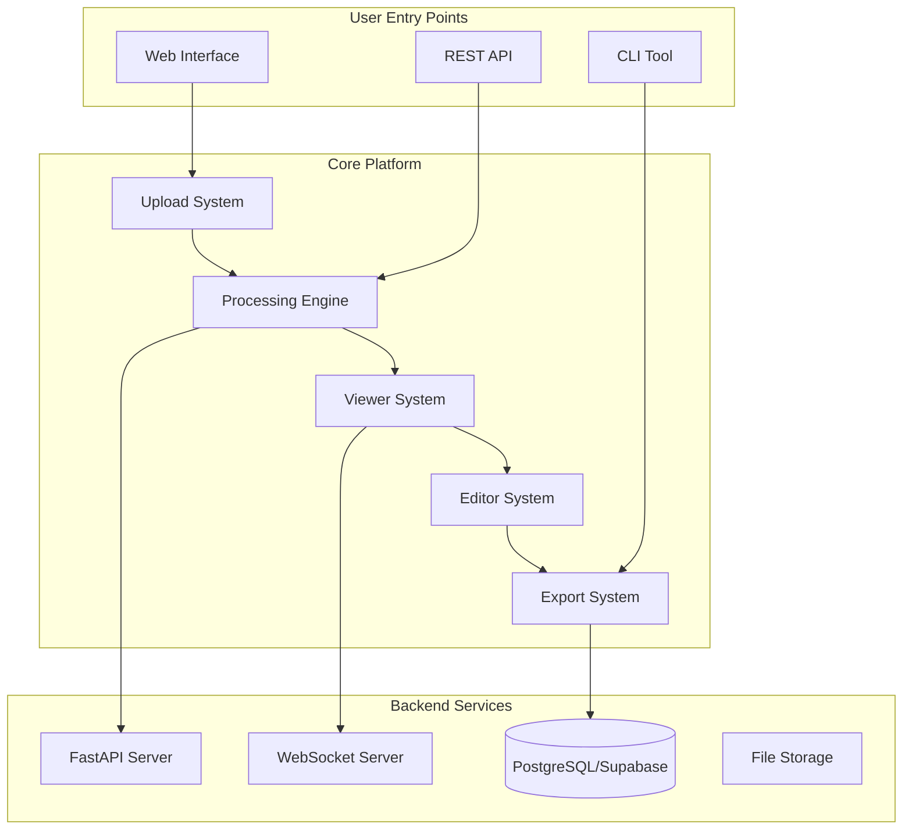
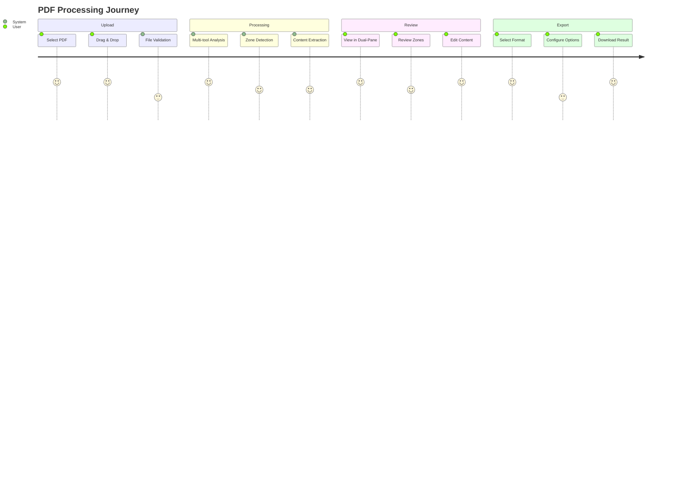
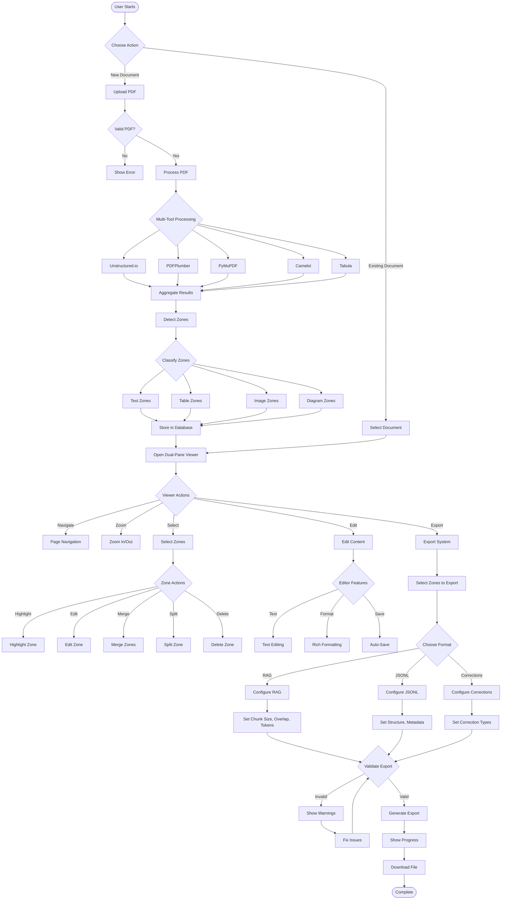
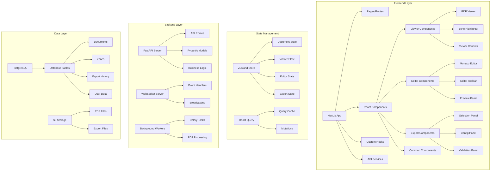
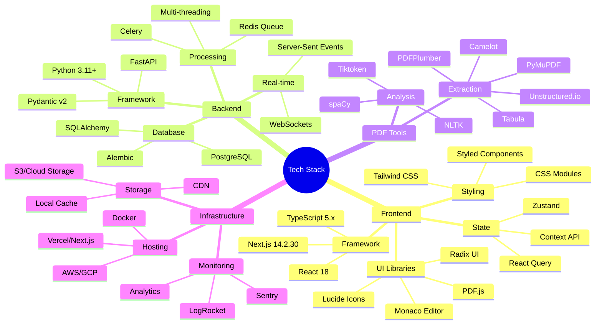
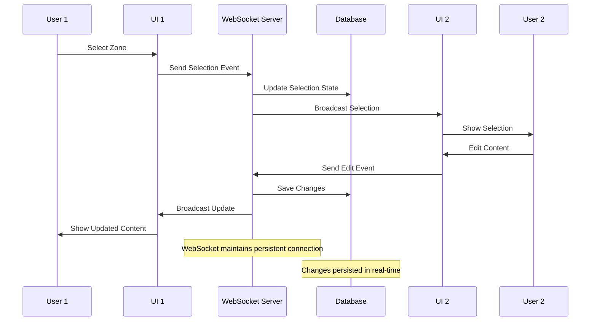
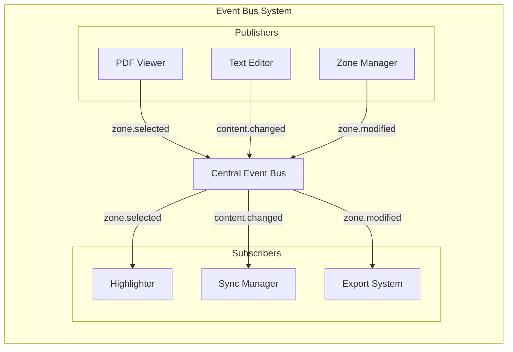
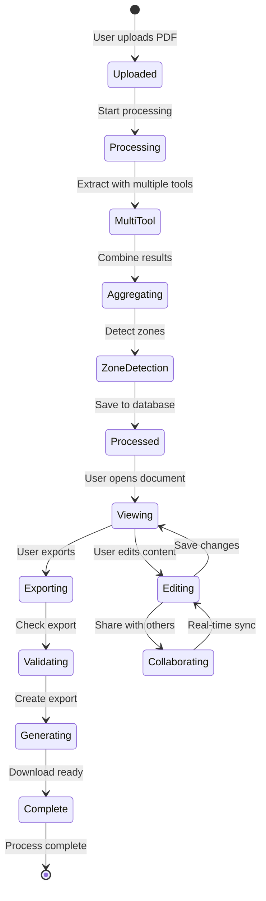
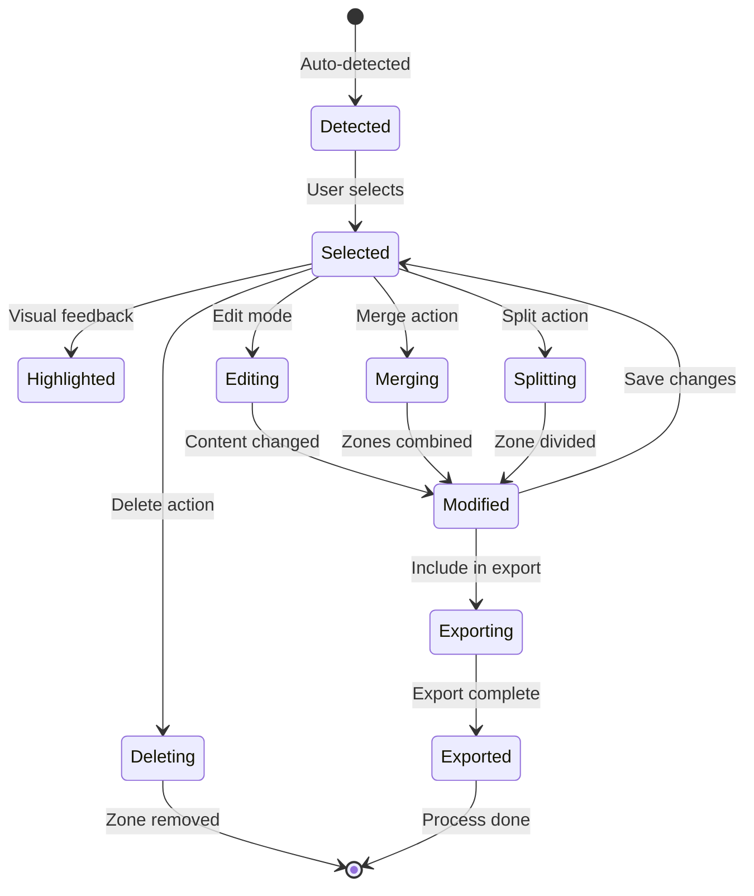

# 🗺️ PDF Intelligence Platform - Complete Ecosystem Map

> A comprehensive visual guide to all workflows, interactions, and tools in the PDF Intelligence Platform

## 📍 Table of Contents

1. [Platform Overview](#platform-overview)
2. [User Journey Flows](#user-journey-flows)
3. [System Architecture](#system-architecture)
4. [Component Interactions](#component-interactions)
5. [Tool Inventory](#tool-inventory)
6. [Data Flow Patterns](#data-flow-patterns)

---

## 🌐 Platform Overview



## 🚶 User Journey Flows

### 1. Complete Document Processing Flow



### 2. Detailed Workflow Diagram



## 🏗️ System Architecture

### Component Hierarchy



### Technology Stack Map



## 🔄 Component Interactions

### Real-time Synchronization Flow



### Cross-Component Event System



## 🛠️ Tool Inventory

### Complete Feature Matrix

| Category | Tool/Feature | Description | Status | Integration Points |
|----------|--------------|-------------|--------|-------------------|
| **PDF Processing** |||||
| | Unstructured.io | General-purpose extraction | ✅ Active | API, Zone Detection |
| | PDFPlumber | Text and table extraction | ✅ Active | API, Table Parser |
| | PyMuPDF | Fast PDF rendering | ✅ Active | Viewer, Thumbnails |
| | Camelot | Advanced table extraction | ✅ Active | Table Detection |
| | Tabula | Java-based table parser | ✅ Active | Table Export |
| **Viewer Features** |||||
| | PDF.js | Client-side PDF rendering | ✅ Active | React, Canvas |
| | Dual-pane View | Side-by-side comparison | ✅ Active | Layout System |
| | Zone Highlighting | Visual zone indicators | ✅ Active | Event Bus |
| | Synchronized Scrolling | Linked viewport scrolling | ✅ Active | Scroll Manager |
| | Page Navigation | Thumbnail & page jump | ✅ Active | Navigation Bar |
| | Zoom Controls | Dynamic zoom levels | ✅ Active | Viewport Manager |
| **Editor Features** |||||
| | Monaco Editor | VSCode-based editor | ✅ Active | React Integration |
| | Rich Text Editing | Formatting tools | ✅ Active | Toolbar |
| | Markdown Support | MD preview & export | ✅ Active | Markdown Parser |
| | JSON Editing | Structured data edit | ✅ Active | JSON Schema |
| | Auto-save | Periodic saving | ✅ Active | Debounced Save |
| | Word Count | Real-time statistics | ✅ Active | Text Analysis |
| **Zone Management** |||||
| | Zone Selection | Multi-select capability | ✅ Active | Selection Manager |
| | Zone Editing | Modify zone boundaries | ✅ Active | Canvas Overlay |
| | Zone Merging | Combine multiple zones | ✅ Active | Zone Algorithm |
| | Zone Splitting | Divide single zone | ✅ Active | Split Logic |
| | Zone Reordering | Drag-drop ordering | ✅ Active | DnD Library |
| | Confidence Display | Show extraction confidence | ✅ Active | Visual Indicators |
| **Export System** |||||
| | RAG Chunking | LLM-optimized chunks | ✅ Active | Tiktoken |
| | JSONL Export | Training data format | ✅ Active | JSON Generator |
| | Corrections Export | Edit tracking | ✅ Active | Diff Algorithm |
| | Manifest Generation | Document metadata | ✅ Active | Meta Collector |
| | Batch Export | Multiple formats | ✅ Active | Queue System |
| | Progress Tracking | Real-time progress | ✅ Active | Progress API |
| **Validation** |||||
| | Schema Validation | Format checking | ✅ Active | AJV |
| | Content Validation | Quality assurance | ✅ Active | Custom Rules |
| | Token Counting | Size estimation | ✅ Active | Tiktoken |
| | Error Reporting | Detailed feedback | ✅ Active | Error System |
| | Override System | Manual approval | ✅ Active | Approval Flow |
| **Collaboration** |||||
| | Real-time Updates | Live synchronization | ✅ Active | WebSocket |
| | Multi-user Editing | Concurrent editing | 🔄 Planned | CRDT/OT |
| | Comment System | Annotations | 🔄 Planned | Comment API |
| | Version Control | Change history | 🔄 Planned | Git Integration |
| **API Features** |||||
| | REST API | Standard endpoints | ✅ Active | FastAPI |
| | GraphQL | Flexible queries | 🔄 Planned | GraphQL Server |
| | Webhooks | Event notifications | ✅ Active | Event System |
| | API Keys | Authentication | 🔄 Planned | Auth System |

## 📊 Data Flow Patterns

### Document Lifecycle



### Zone State Machine



## 🎯 Key User Workflows

### 1. Quick Extract Workflow
```
Upload PDF → Auto-process → View results → Quick export (RAG chunks)
Time: ~2-3 minutes
```

### 2. Detailed Review Workflow
```
Upload → Process → Review all zones → Edit/correct content → Validate → Configure export → Download
Time: ~10-15 minutes
```

### 3. Collaborative Workflow
```
Upload → Process → Share link → Multiple users edit → Review changes → Approve → Export
Time: Variable
```

### 4. Batch Processing Workflow
```
Upload multiple PDFs → Queue processing → Bulk zone review → Batch configuration → Mass export
Time: ~5 minutes per document
```

### 5. API Integration Workflow
```
API upload → Webhook notification → Automated processing → Programmatic export → API response
Time: ~1-2 minutes
```

## 🔗 Integration Points

### External Services
- **Storage**: S3, Google Cloud Storage, Azure Blob
- **Authentication**: Auth0, Supabase Auth, Custom JWT
- **Analytics**: Google Analytics, Mixpanel, Custom Events
- **Monitoring**: Sentry, LogRocket, DataDog
- **LLM Services**: OpenAI, Anthropic, Local Models

### Internal APIs
- **Document API**: CRUD operations for documents
- **Zone API**: Zone management endpoints
- **Export API**: Export generation and download
- **WebSocket API**: Real-time synchronization
- **Processing API**: PDF processing triggers

---

This ecosystem map provides a complete overview of the PDF Intelligence Platform, showing how all components work together to deliver a comprehensive PDF processing solution.